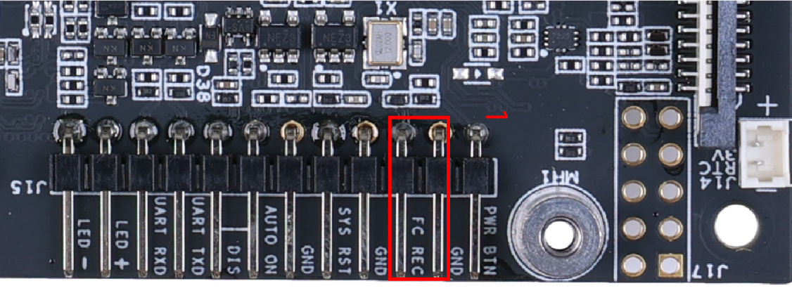

Jetson Orin
===========

Dans le cadre du projet, Ubuntu 22.04 a été installé sur une carte Jetson Orin, spécifiquement sur une carte Seeed Studio reComputer J3011, qui embarque la carte NVIDIA Jetson Orin Nano 8GB.

Cette section détaille l'installation de Jetpack 6.0, incluant Ubuntu 22.04, sur la carte Jetson Orin.

.. warning::
    Au moment de la rédaction de cette documentation, Jetpack 6.0 est uniquement disponible en version Developer Preview.
    Par conséquent, l'installation peut légèrement différer de la version finale.

Prérequis
---------

Système d'exploitation
~~~~~~~~~~~~~~~~~~~~~~

Pour installer Jetpack 6.0 sur la carte, un ordinateur avec Ubuntu est requis.

.. warning::
    L'utilisation d'une machine virtuelle n'est pas prise en charge.

SDK Manager
~~~~~~~~~~~

Le SDK Manager de NVIDIA sera utilisé, mais il est également possible de procéder à l'installation en ligne de commande.

Il peut être téléchargé à partir de l'adresse suivante : `https://developer.nvidia.com/sdk-manager <https://developer.nvidia.com/sdk-manager>`_.

.. warning::
    Un compte développeur NVIDIA est nécessaire pour télécharger le SDK Manager et pour se connecter à celui-ci.

Préparation
-----------

Un jumper doit être ajouté à la carte Jetson Orin pour activer le mode recovery.

Installation
------------

Tout d'abord, connectez la carte Jetson Orin à l'ordinateur via un câble USB-C et assurez-vous qu'elle est alimentée.
Utilisez la commande :console:`lsusb` pour vérifier si la carte est reconnue.

.. thumbnail:: _images/lsusb.png
    :alt: lsusb
    :align: center
    :scale: 25%

|

Ensuite, lancez le SDK Manager et connectez-vous avec votre compte développeur NVIDIA.

Normalement, le SDK Manager devrait reconnaître la carte Jetson Orin.
Vous pouvez ensuite sélectionner la version de Jetson Orin.

.. thumbnail:: _images/step1_select_jetson_orin.png
    :alt: Select Jetson Orin version
    :align: center

|

Ensuite, choisissez la version de Jetpack 6.0.

.. thumbnail:: _images/step1_default.png
    :alt: Select Jetpack 6.0
    :align: center

|

Voici les composants à sélectionner pour la phase 2 de l'installation.

.. thumbnail:: _images/step2.png
    :alt: Step 2
    :align: center

|

Pour les étapes suivantes de l'installation, vous pouvez conserver les options par défaut.

Une fois l'installation terminée, retirez le jumper de la carte Jetson Orin et redémarrez-la.